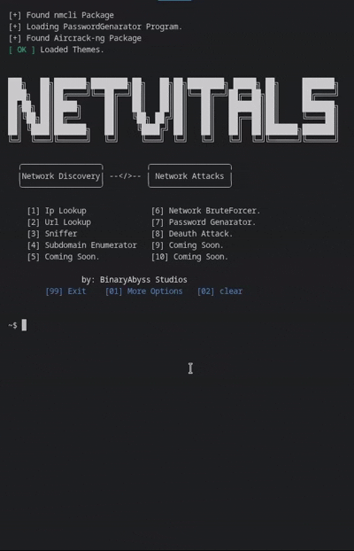

# 🌐 NetVitals

[](https://discord.gg/A2HGSGVhey)


**Netvitals is a program that contains Tools about Networking and Cracking Wifi Hashes and Passwords Wirelessly.**

- **in this Tool you can Find Everyone Location Using his IP address (internet protocol) and every url information in the built in url lookup.**

- **you can find Forgotten Websites with Subdomain Enumerator Tool, and there is a bulit in Default Wordlist.**

- **Test Network Paaswords and Capture Hashes**

- **We Currently Supported 3 Offical OS  (Linux, Macos, Windows). & All Linux Distributions.**



# Installations

**Windows**

- Method 1
  Install the executable (exe) file and run it.

- Method 2
  Install the project using interpeter, run main.py by using in the Terminal : python3 main.py    [enure you are in the right directory src folder]


**Linux** *(All Distros)* & **MacOS**

- Method 1
  Install Project Zip File using the WEB (here) or by typing in the terminal to run it directly after installation:
``` bash
  git clone https://github.com/BinaryAbyssStudios/NetVitals.git
  cd NetVitals/
  python3 -m venv .venv # Virtual Enviroment
  source .venv/bin/activate # Activate Virtual Enviroment
  pip install -r requirements.txt # Install Program Requirements
  python3 src/main.py # EntryPoint
```

**Thank you for supporting us.**